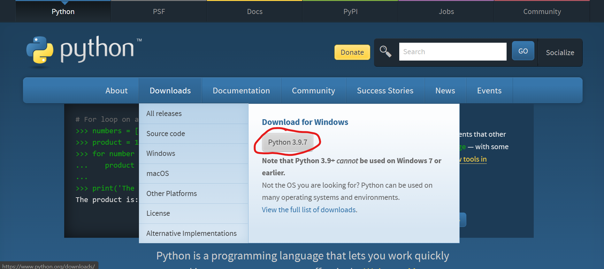

# 安装与配置
## Python的安装
python可以在[python官网](https://www.python.org/)下载。



如果没有管理员权限，请在[微软商店](https://www.microsoft.com/en-us/p/python-39/9p7qfqmjrfp7)下载。

## 安装PyVogen
在命令行中运行：（windows系统在开始菜单中搜索cmd，mac系统请打开终端，然后粘贴以下命令，回车）
```
pip install vogen 
```

## 安装音源
在命令行中运行：
```
pyvogen pm install <音源包路径>
```
安装完成后，用以下命令查看已安装音源：
```
pyvogen pm list
```

或者也可以在python内安装
```py
from vogen import pm
pm.install("音源路径")
```

进行以上配置后，可以合成歌声。如果想要获得更好的交互编程体验，可下载jupyter notebook及其vscodium插件。本仓库中的多篇文档为ipynb格式，按以下方法配置后，可直接打开运行。

## jupyter notebook的配置
### 安装jupyter notebook
在命令行中运行：
```
pip install jupyter
```
安装完成后，即可在命令行中打开jupyter notebook。
jupyter notebook以网页作为界面，将在你的默认浏览器中打开。
```
jupyter notebook
```

### 安装jupyter vscodium插件
与jupyter notebook相比，jupyter vscodium插件提供了代码自动补全、ipynb文件关联功能，让你的开发更高效。

注意：**必须使用vscodium，不能使用vscode**，因为vscode不支持在jupyter notebook中播放音频。

#### 安装vscodium
在[vscodium发布页](https://github.com/VSCodium/vscodium/releases)下载vscodium。

展开Assets，往下翻，找到适合你系统的版本


在安装过程中，请勾选“添加到Path”选项

#### 配置vscodium
安装完成后，找到安装位置，用记事本打开"安装位置\resources\app\product.json"，将"extensionsGallery"项的值改为：
```
"extensionsGallery": {
    "serviceUrl": "https://marketplace.visualstudio.com/_apis/public/gallery",
    "itemUrl": "https://marketplace.visualstudio.com/items"
}
```


打开"安装位置\bin"文件夹，将codium和codium.cmd分别复制为code和code.cmd


#### 安装jupyter插件
打开vscodium，在插件商店搜索jupyter，点击安装


安装完成后，新建一个文本文件，修改后缀名为ipynb，用vscode打开，连接到内核后，即可自动提示。


