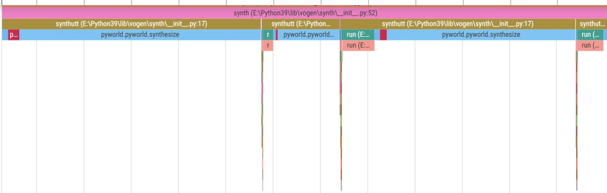

# pyvogen常见问题
## 使用相关

## 设计相关
### 为什么pyvogen不支持多线程/pyvogen为什么不能更快一些
众所周知，python的多线程是伪多线程，即同一时刻只能有一个线程运行python代码，所谓“多线程”也只是在不同线程之间切换，无法真正并行。这一机制称为GIL（全局解释器锁）

当然，在线程运行c代码时，可以让另一个线程利用这个时机运行python代码。这需要c库适配多线程。numpy、onnxruntime均已适配，因此可以真正地多线程运行

不幸的是，pyworld并未适配多线程，而pyworld是pyvogen的性能瓶颈。因此，多线程无法带来显著的性能提升。
